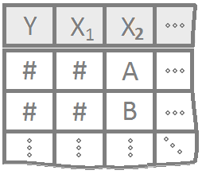
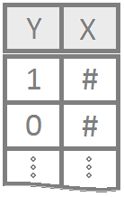

 

----

## Blogs

* [Statistic by Jim](https://statisticsbyjim.com/)

----
  
## Reference

[Customization Help](RMarkdownHints.html)
  

<!-- Add your customizations in the area below: -->

**1 Quantitative Variable**

Y is a quantitative variable that represents measures on individual units (i.e. height of people)

**Appropriate Tests**

[T-test, Paired T-test](tTests.html) |
[Wilcoxon Signed-Rank Test](WilcoxonTests.html)

**Appropriate Summaries**

[Mean, Median, Five-number summary, Standard Deviation](NumericalSummaries.html)

**Appropriate Graphs**

[Histogram, Boxplot](GraphicalSummaries.html)

<!------------------------------------------------>

----

<!-- Add your customizations in the area below: -->

**1 Quantitative Variable | 2 Groups**

Y is a quantitative measure and x are the two groups.

**Appropriate Tests**

[Independent T-test](tTests.html) |
[Wilcoxon Rank-Sum (Mann-Whitney) Test](WilcoxonTests.html)

**Appropriate Summaries**

[Mean, Median, Five-number summary, Standard Deviation](NumericalSummaries.html)

**Appropriate Graphs**

[Boxplot, Dot Plots](GraphicalSummaries.html)

<!------------------------------------------------>

----

<!-- Add your customizations in the area below: -->

**1 Quantitative Variable | 3+ Groups**

This is when there are 3 or more groups. These groups would be a part of factor. A factor is an item that has several levels, or groups.

**Appropriate Tests**

[One-Way ANOVA, Two-Way ANOVA](ANOVA.html) | [Kruskal-Wallis Test](Kruskal.html)

**Appropriate Summaries**

[Mean, Median, Five-number summary, Standard Deviation](NumericalSummaries.html)

**Appropriate Graphs**

[Boxplot, Dot Plots, Scatterplots](GraphicalSummaries.html)

<!------------------------------------------------>

----

<!-- Add your customizations in the area below: -->

**2 Quantitative Variables**

This is when two quantitative variables are used to determine if there is a linear relationship between the two or not.

**Appropriate Tests**

[Simple Linear Regression](LinearRegression.html)

**Appropriate Summaries**

[Mean, Median, Percentile, Correlation](NumericalSummaries.html)

**Appropriate Graphs**

[Scatterplots](GraphicalSummaries.html)

<!------------------------------------------------>

----

<!-- Add your customizations in the area below: -->

**1 Quantitative Response | Multiple Explanatory Variables**

More than one response variable to y is used in order to help determine a linear correlation between the x points and y.

**Appropriate Tests**

[Multiple Linear Regression](LinearRegression.html)

**Appropriate Summaries**

[Mean, Median, Percentile, Correlation](NumericalSummaries.html)

**Appropriate Graphs**

[Scatterplots](GraphicalSummaries.html)

<!------------------------------------------------>

----

<!-- Add your customizations in the area below: -->

**Binomial Response | 1 Explanatory Variable**

Regression for a qualitative binary response variable (Yi=0 or 1), using a single (typically quantitative) explanatory variable.

**Appropriate Tests**

[Logistic Regression](LogisticRegression.html)

**Appropriate Summaries**

[Mean, Median, Mode, Minimum, Maximum, Standard Deviation, Quartiles](NumericalSummaries.html)

**Appropriate Graphs**

[Custom Plot - S Curve Graph](GraphicalSummaries.html)

<!------------------------------------------------>

----

<!-- Add your customizations in the area below: -->

**Binomial Response | Multiple Explanatory Variables**

Regression for a qualitative binary response variable (Yi=0 or 1). The explanatory variables can be either quantitative or qualitative.

**Appropriate Tests**

[Multiple Logistic Regression Model](LogisticRegression.html)

**Appropriate Summaries**

[Mean, Median, Mode, Minimum, Maximum, Standard Deviation, Quartiles](NumericalSummaries.html)

**Appropriate Graphs**

[Custom Plot - S Curve Graph](GraphicalSummaries.html)

<!------------------------------------------------>

----

<!-- Add your customizations in the area below: -->

**2 Qualitative Variables**

Association testing for two qualitative variables with at least two levels to each variable.

**Appropriate Tests**

[Chi-squared Test of Independence](ChiSquaredTests.html) | [Nonparametric Chi-squared Test](ChiSquaredTests.html)

**Appropriate Summaries**

[Mean, Median, Mode, Minimum, Maximum](NumericalSummaries.html)

**Appropriate Graphs**

[Barplot, Dotplot](GraphicalSummaries.html)

<!------------------------------------------------>

----

<footer></footer>

